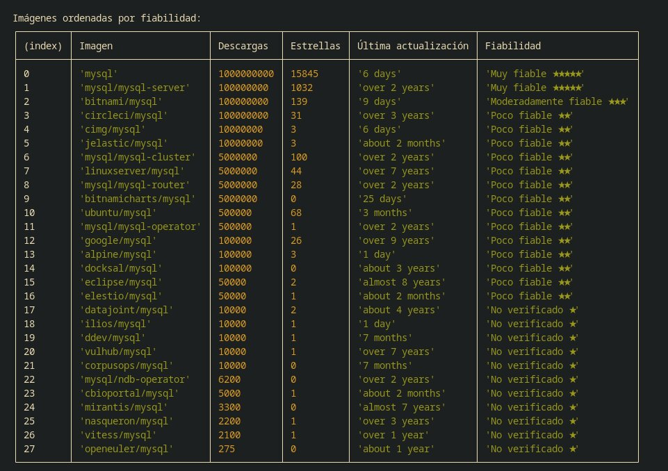

# dockerhub-fiability-web-scrapping

La fiabilidad se definió en diferentes niveles: muy fiable, fiable, moderadamente fiable, poco fiable y no verificado basado en sus descargs y estrellas

Se usó Puppeteer debido a que se tenía que ejecutar el js de la página, no era estática y cheerio para manipular lo obtenido

En la siguiente imagen se puede visualizar los resultados:
